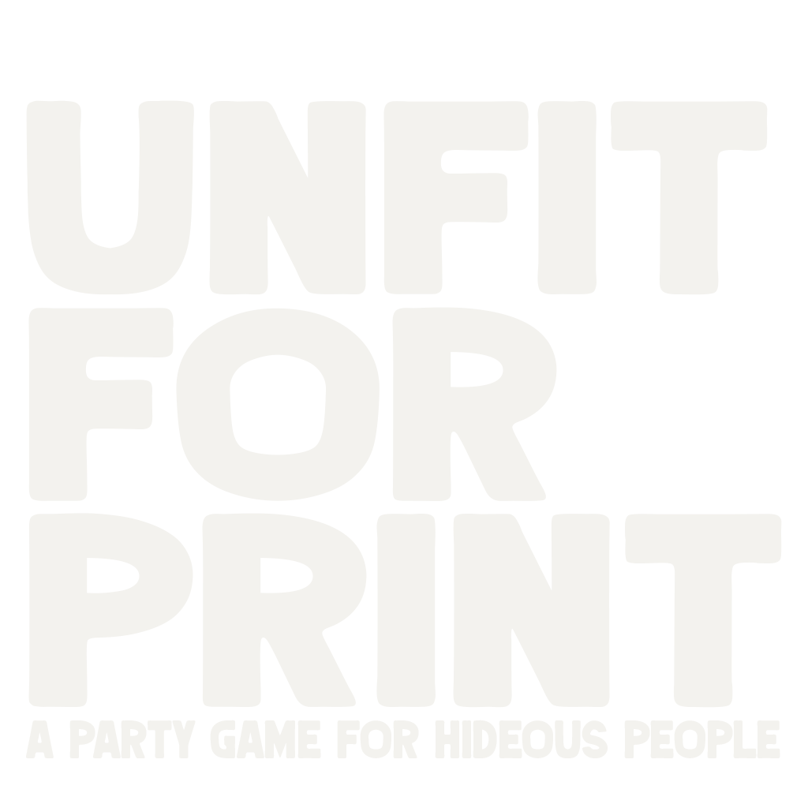

<picture>
  <source media="(prefers-color-scheme: dark)" srcset="public/img/unfit_logo.png">
  <source media="(prefers-color-scheme: light)" srcset="public/img/unfit_logo_dark.png">
  
</picture>

## About the Game

**UNFIT FOR PRINT - A PARTY GAME FOR HIDEOUS PEOPLE** is a hilarious and outrageous card game designed to bring out your inner comedian. With its fancy looks and engaging gameplay, it's the perfect party game for those who love to laugh and compete.

### Features

- **Lobbies**: Easily create or join lobbies to play with friends or strangers.
- **Rare Cards**: Collect unique and rare cards to enhance your deck.
- **Score Tracking**: Keep track of your victories and climb the leaderboard.
- **Fancy Sound Effects**: Immerse yourself in the game with high-quality sound effects.
- **More to Come**: We're constantly adding new features and content to keep the game fresh and exciting.

Get ready to unleash your creativity and wit in this one-of-a-kind card game experience!

This totally wasn't made by ChatGPT, I swear.
## How to Play
1. **Create or Join a Lobby**: Start by creating a new lobby or joining an existing one. You can invite friends or play with random players.
2. **Select Cards**: Each player will be dealt a hand of cards. Choose the best card to play for each round.
3. **Play the Game**: Take turns playing cards and trying to outwit your opponents. The player with the funniest or most outrageous card wins the round.
4. **Score Points**: Earn points for each round you win. The player with the most points at the end of the game is declared the winner.
5. **Collect Rare Cards**: As you play, you'll have the chance to collect rare cards that can give you an edge in future games.
6. **Have Fun**: The most important rule is to have fun! Enjoy the laughter and camaraderie that comes with playing UNFIT FOR PRINT.

### OVERPROMISE, UNDERDELIVER!

