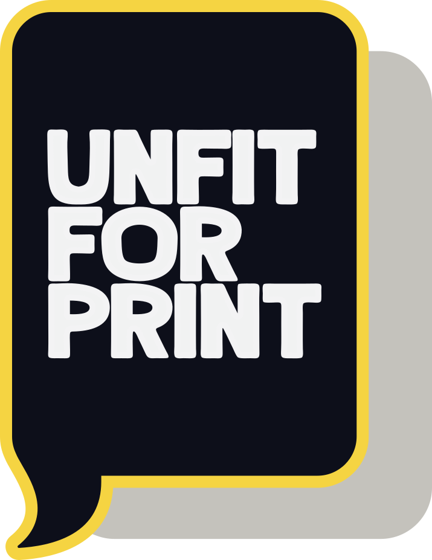
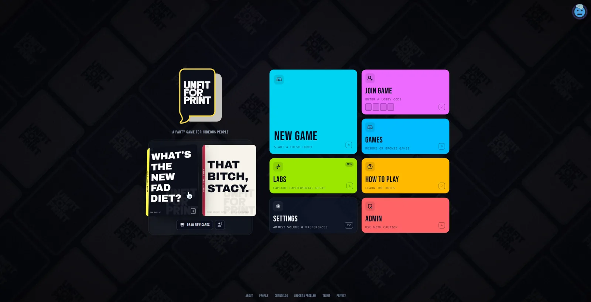
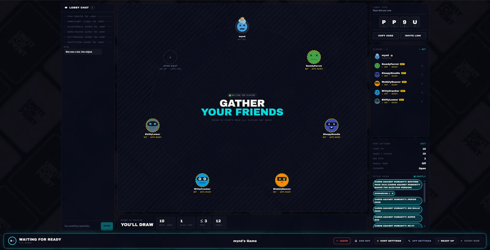
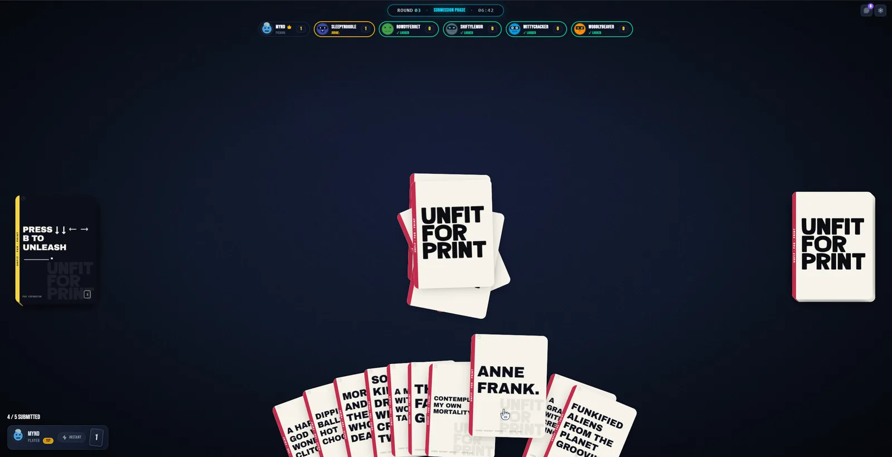
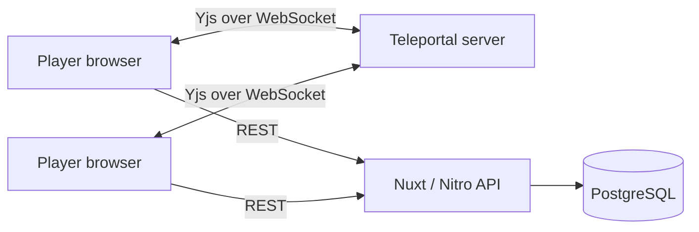

<div align="center">


# UNFIT FOR PRINT

**A party game for hideous people.**

[](https://github.com/PPO-GG/unfit-for-print/actions/workflows/release-please.yml)
[](https://github.com/PPO-GG/unfit-for-print/releases)
[](https://creativecommons.org/licenses/by-nc-sa/4.0/)

**[Play now at unfit.cards](https://unfit.cards)** · [How to play](https://unfit.cards/about) · [Changelog](CHANGELOG.md) · [Report a bug](https://github.com/PPO-GG/unfit-for-print/issues)

</div>

<p align="center">
  
</p>

Unfit for Print is a Cards Against Humanity-style game for the browser. Start a lobby, share the four-letter code, and take turns being terrible. One player judges each round, everyone else plays their worst white card, and the judge picks a winner. First to the target score wins.

Made by **MYND** at **[PPO.GG](https://ppo.gg)**.

> _Not affiliated with Cards Against Humanity — we just love their game._

## Screenshots

<table>
  <tr>
    <td width="50%"></td>
    <td width="50%"></td>
  </tr>
  <tr>
    <td align="center"><sub>The lobby: fill empty seats with bots while you wait for friends</sub></td>
    <td align="center"><sub>Mid-round: pick a card from your hand before the judge reveals</sub></td>
  </tr>
</table>

## Features

**At the table**

- **Real-time multiplayer.** Every play, reveal and pick syncs instantly across the table.
- **Rotating judge.** Everyone takes a turn choosing the funniest (or most horrible) answer, and the judge can skip one dud prompt per round.
- **Bots.** The host can fill empty seats with up to five bots, so a game of three still feels like a party.
- **Card packs.** Choose which decks to play with each game, including the community-made Unfit Labs pack.
- **Read aloud.** The judge can have cards read out to the whole table with text-to-speech.
- **Host controls.** Set the target score and hand size, and skip a stalled player or judge so the round keeps moving.
- **Spectators.** Watch a game in progress and deal yourself in when you're ready.

**Lobbies and social**

- **Public or private lobbies.** Browse open games or share a code and invite link. Private lobbies can require a password.
- **Lobby chat** for talking trash between rounds.
- **Discord Activity.** Play right inside a Discord voice channel.
- **Discord login or guest.** Jump in without an account, or sign in to keep your profile.
- **Avatar decorations** to dress up your seat.

**Unfit Labs**

- **Write your own cards.** Submit white or black cards, vote on other people's, and the best ones get adopted into the Unfit Labs pack.

**Everywhere else**

- **9 interface languages:** English, Spanish, French, German, Portuguese, Russian, Japanese, Korean and Chinese. Card text stays in English because the jokes don't survive translation.
- **Installable** as a PWA on desktop and mobile.
- **Sound effects** to keep the energy up.

## Tech stack

| Layer     | Tech                                                   |
| --------- | ------------------------------------------------------ |
| Framework | Nuxt 4, Vue 3 Composition API                          |
| UI        | Nuxt UI v4, Tailwind CSS 4, GSAP                       |
| Real-time | Yjs CRDTs over a custom Teleportal WebSocket server    |
| Backend   | Nitro server routes, PostgreSQL with Drizzle ORM       |
| Auth      | Discord OAuth2 and guest accounts (`nuxt-auth-utils`)  |
| i18n      | `@nuxtjs/i18n`, 9 locales                              |
| Testing   | Vitest                                                 |
| Hosting   | Self-hosted Docker images, published to GHCR on release |

## How it works

State is split by how long it needs to live.

- **Live game state** (hands, submissions, scores, whose turn it is) lives in a Yjs document. Every game action runs in the players' browsers and syncs through the Teleportal server in [`teleportal-server/`](teleportal-server/). Nothing is written to disk. When the last player leaves, the document is gone.
- **Durable data** (users, lobbies, cards and packs, Labs submissions, reports) lives in Postgres and is reached only through the Nitro API in [`server/api/`](server/api/).


```mermaid
flowchart LR
    B1[Player browser] <-- Yjs over WebSocket --> T[Teleportal server]
    B2[Player browser] <-- Yjs over WebSocket --> T
    B1 -- REST --> W[Nuxt / Nitro API]
    B2 -- REST --> W
    W --> DB[(PostgreSQL)]
```

The game rules live in [`app/composables/useYjsGameEngine.ts`](app/composables/useYjsGameEngine.ts). For the full architecture, conventions and gotchas, read [`AGENTS.md`](AGENTS.md).

## Running locally

You'll need **Node 22**, **pnpm 10** (`corepack enable` gets you the pinned version), and **Postgres 16**. Docker is the easiest way to get Postgres.

**1. Install and configure**

```bash
pnpm install
cp .env.example .env
```

`DATABASE_URL` and `NUXT_SESSION_PASSWORD` are required. Generate the session password with `openssl rand -base64 32`. Everything else is optional: the Discord keys are only needed for Discord login and the Activity, and the TTS and R2 keys only for read-aloud voices and decoration uploads. Guest play works without them.

**2. Start Postgres and apply migrations**

```bash
docker run -d --name unfit-postgres -p 5432:5432 -e POSTGRES_USER=unfit -e POSTGRES_PASSWORD=unfit -e POSTGRES_DB=unfit postgres:16-alpine
```

```bash
pnpm db:migrate
```

That container matches the default `DATABASE_URL` in `.env.example`.

**3. Run the Teleportal server**

`.env.example` points at the production Teleportal (`wss://teleportal.unfit.cards`). For development, run your own so your test lobbies stay local:

```bash
cd teleportal-server && pnpm install && pnpm dev
```

Then set `NUXT_PUBLIC_LOBBY_TELEPORTAL_URL=ws://localhost:1235` in `.env`.

**4. Start the app**

```bash
pnpm dev
```

The app runs at <http://localhost:3000>.

**5. Add some cards**

A fresh database has no cards. To load some, sign in once (guest is fine), then make yourself an admin by setting `is_admin = true` on your row in the `users` table. `pnpm db:studio` is the quickest way to do that. Then open `/admin/cards/upload` and upload a card-pack JSON: an array of `{ name, white: [...], black: [{ text, pick }] }` packs. The schema is in [`server/api/dev/seed.ts`](server/api/dev/seed.ts).

### Tests

```bash
pnpm test
```

The server and database suites delete table data before every test, so they refuse to run unless `TEST_DATABASE_URL` is set **and differs from `DATABASE_URL`**. Point it at a throwaway database, never your real one:

```bash
docker run -d --name unfit-postgres-test -p 5433:5432 -e POSTGRES_USER=unfit -e POSTGRES_PASSWORD=unfit -e POSTGRES_DB=unfit postgres:16-alpine
```

Then apply migrations to it with `DATABASE_URL=$TEST_DATABASE_URL pnpm db:migrate`.

## Contributing

Found a bug or have an idea? [Open an issue](https://github.com/PPO-GG/unfit-for-print/issues). Pull requests are welcome.

- Commits follow [Conventional Commits](https://www.conventionalcommits.org/), and commitlint enforces this in CI. The scopes in use are `web`, `server` and `bot`.
- [release-please](https://github.com/googleapis/release-please) builds releases and the changelog from those commits, so don't edit `CHANGELOG.md` or the version in `package.json` by hand.
- All work targets `main`.
- New user-facing strings go in `i18n/locales/en.json` at minimum.

_Still in active development. Things might break, and things might not work as intended._

## License

Licensed under [CC BY-NC-SA 4.0](https://creativecommons.org/licenses/by-nc-sa/4.0/). See [LICENSE](LICENSE) for details.
